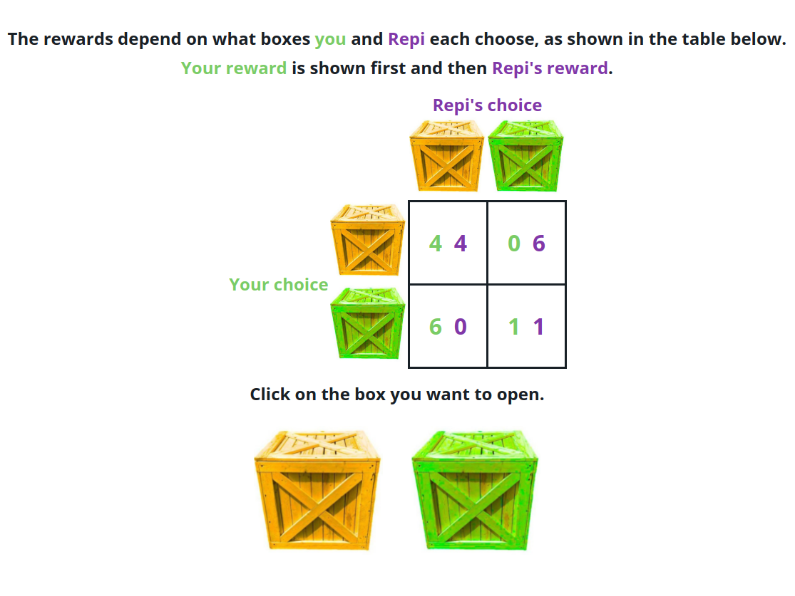

# Introduction

How do we use language to coordinate with each other? This question is of interest both from the cognitive science of language perspective as well as the game theory perspective. 

In studies of conversation, there's work on how people align with each other in their word use when doing joint task and how repeatedly referring to the same targets in a matching game leads to the formation of linguistic conventions. As reference is a key part of other linguistic speech acts such as negotiation, coordinating actions, or persuasion, one might wonder whether referential coordination can also be seen during interactions in pursuit of these more complex goals. In a similar vein, more complex situations may allow for linguistic alignment and convention formation not just of terms of reference but of terms for entire strategic approaches. One could also imagine alignment in approach, creating a conventional structure for how to coordinate or negotiate. (todo possible citations)

Despite the relevance of these questions, from both a linguistic perspective and an applied psychology perspective, the large body of work on conversational alignment and referential communication has rarely branched out to situations where incentives are not fully aligned between agents. 

In prior work, we tried to look at the role of language in a 3-player negotiation game where incentives were either fully-aligned or competitive between players [@mankewitz2021; @boyce2023b]. We found some evidence that language use improved performance, and that the referential language used to pick out targets showed some signs of conventionalization over time. However, this was a game we had created, so there were not theoretical or analytic predictions about what the optimal strategies were either with or without language, and therefore, when or how communication (via language) might improve performance. 

Game theory provides a formalism for understanding rational action when different actors have different incentive structures over outcomes that are jointly determined by the choices of all the actors. There is some theoretical work analyzing how communication availability may shift the strategies in games and thus when communicative acts are credible signals versus cheap talk [@cooper1992; @foerster2021; @baliga2002]. Game theory economic games have been used to empirically study questions such as social prediction [@vanbaar2021], emotional signals [@demelo2020], and coordination [@duguid2014]. Some studies test predictions about the role of communication in economic games [@crandall2018; @cross; @crawford2019a]. (todo: check/reread citations, possible find more citations?)

In our current work, we attempted to bridge that gap, by looking at the role of language in two classic game theory games. By using set-ups that are well studied in the game theory literature, we had a rich body of work understanding how rational agents would play, and when linguistic coordination could be useful. 

We focused on two games from within the 2x2 game space: Prisoner's Dilemma (PD) and Bach or Stravinsky (BoS). 

In Prisoner's Dilemma (Figure \ref{payoff-PD}), each player individually prefers the rewards they get from playing B to the rewards they get from playing A (holding the other player's action constant). However, the outcome from both playing A is better for each player than the outcome from both playing B. Thus, the Nash equilibrium, where no player can benefit from making a unilateral change in action is BB, and so game theorists expect rational agents playing a one-shot game of PD to each choose B. The prediction from game theory is that availability of communication should not change behavior in a PD games because it would be "cheap talk" -- there is no incentive to be truthful about one's planned action. 

In Bach or Stravinsky (Figure \ref{payoff-BoS}), both players only receive rewards if they choose the same option. However, player X prefers the AA option and B prefers the BB option. Thus, there are two Nash equilibria, either AA or BB. In a one-shot game of BoS, there is no way for participants to break the symmetry. Communication is predicted to be potentially useful, if it allows participants to break this symmetry and agree on which cell to align on. 


```{r set-up, include=F}
knitr::opts_chunk$set(
  out.width = "\\textwidth",
  fig.align = "center", fig.width = 8, fig.height = 4, fig.crop = F, fig.align = "center", fig.env = "figure",
  fig.pos = "tb", fig.path = "figs/",
  echo = F, warning = F, cache = F,
  message = F, sanitize = T
)
library(tidyverse)
library(jsonlite)
library(here)
library(rlang)
library(lme4)
library(brms)
library(rstan)
library(viridis)
library(knitr)

theme_set(theme_bw())

source(here("manuscript/prep.R"))

stats <- function(model, row, decimal = 2) {
  model <- model |>
    mutate(
      Estimate = round(Estimate, digits = decimal),
      Lower = round(lower, digits = decimal),
      Upper = round(upper, digits = decimal),
      `Credible Interval` = str_c("[", Lower, ", ", Upper, "]")
    ) |>
    select(Term, Estimate, `Credible Interval`)
  str_c(model[row, 1], ": ", model[row, 2], " ", model[row, 3])
}

stats_text <- function(model, row, decimal = 2) {
  model <- model |>
    mutate(
      Estimate = round(Estimate, digits = decimal),
      Lower = round(lower, digits = decimal),
      Upper = round(upper, digits = decimal),
      `Credible Interval` = str_c("[", Lower, ", ", Upper, "]")
    ) |>
    select(Term, Estimate, `Credible Interval`)
  str_c(model[row, 2], "  ", model[row, 3])
}

```


```{=latex}
	\begin{figure}
		\caption{Reward structure for each game. In each cell, the reward for X is shown before the reward for Y. }
		\label{payoff-matrix}
		\setlength{\extrarowheight}{2pt}
		\begin{subfigure}[b]{0.45\textwidth}
			\caption{PD generalized -- Each player prefers B to A, but players prefer AA to BB. }
			\label{payoff-PD}
		\begin{tabular}{cc|c|c|}
			& \multicolumn{1}{c}{} & \multicolumn{2}{c}{Player $Y$}\\
			& \multicolumn{1}{c}{} & \multicolumn{1}{c}{$A$}  & \multicolumn{1}{c}{$B$} \\\cline{3-4}
			\multirow{2}*{Player $X$}  & $A$ & $(2,2)$ & $(0,3)$ \\\cline{3-4}
			& $B$ & $(3,0)$ & $(1,1)$ \\\cline{3-4}
		\end{tabular}
		\end{subfigure}
		~~~~
			\begin{subfigure}[b]{0.45\textwidth}
			\caption{BoS generalized-- X prefers AA and Y prefers BB, but both prefer either to AB or BA.}
			\label{payoff-BoS}
			\begin{tabular}{cc|c|c|}
				& \multicolumn{1}{c}{} & \multicolumn{2}{c}{Player $Y$}\\
				& \multicolumn{1}{c}{} & \multicolumn{1}{c}{$A$}  & \multicolumn{1}{c}{$B$} \\\cline{3-4}
				\multirow{2}*{Player $X$}  & $A$ & $(2,1)$ & $(0,0)$ \\\cline{3-4}
				& $B$ & $(0,0)$ & $(1,2)$ \\\cline{3-4}
			\end{tabular}
		\end{subfigure}
		\bigskip
		
		\bigskip
								\begin{subfigure}[b]{0.45\textwidth}
			\caption{Example PD easy: Here the total reward from AA is greater that the total reward from AB or BA.}
			\label{payoff-PDeasy}
			\begin{tabular}{cc|c|c|}
				& \multicolumn{1}{c}{} & \multicolumn{2}{c}{Player $Y$}\\
				& \multicolumn{1}{c}{} & \multicolumn{1}{c}{$A$}  & \multicolumn{1}{c}{$B$} \\\cline{3-4}
				\multirow{2}*{Player $X$}  & $A$ & $(5,5)$ & $(0,7)$ \\\cline{3-4}
				& $B$ & $(7,0)$ & $(2,2)$ \\\cline{3-4}
			\end{tabular}
		\end{subfigure}
		~~~~
		\begin{subfigure}[b]{0.45\textwidth}
			\caption{Example BoS normal: The scale of the two rewards is relatively similar. }
			\label{payoff-BoSnormal}
			\begin{tabular}{cc|c|c|}
				& \multicolumn{1}{c}{} & \multicolumn{2}{c}{Player $Y$}\\
				& \multicolumn{1}{c}{} & \multicolumn{1}{c}{$A$}  & \multicolumn{1}{c}{$B$} \\\cline{3-4}
				\multirow{2}*{Player $X$}  & $A$ & $(6, 2)$ & $(0,0)$ \\\cline{3-4}
				& $B$ & $(0,0)$ & $(2,6)$ \\\cline{3-4}
			\end{tabular}
		\end{subfigure}
		
		\bigskip
		\bigskip
			\begin{subfigure}[b]{0.45\textwidth}
			\caption{Example PD hard: Here the total reward from AB or BA is greater than AA because the highest reward is more than double the second highest.}
			\label{payoff-PDhard}
			\begin{tabular}{cc|c|c|}
				& \multicolumn{1}{c}{} & \multicolumn{2}{c}{Player $Y$}\\
				& \multicolumn{1}{c}{} & \multicolumn{1}{c}{$A$}  & \multicolumn{1}{c}{$B$} \\\cline{3-4}
				\multirow{2}*{Player $X$}  & $A$ & $(4,4)$ & $(0,11)$ \\\cline{3-4}
				& $B$ & $(11,0)$ & $(2,2)$ \\\cline{3-4}
			\end{tabular}
		\end{subfigure}
		~~~~
				\begin{subfigure}[b]{0.45\textwidth}
			\caption{Example BoS spike: One of the rewards is much higher than the other, raising the stakes of which of AA or BB to aim for. }
			\label{payoff-BoSspike}
			\begin{tabular}{cc|c|c|}
				& \multicolumn{1}{c}{} & \multicolumn{2}{c}{Player $Y$}\\
				& \multicolumn{1}{c}{} & \multicolumn{1}{c}{$A$}  & \multicolumn{1}{c}{$B$} \\\cline{3-4}
				\multirow{2}*{Player $X$}  & $A$ & $(28,5)$ & $(0,0)$ \\\cline{3-4}
				& $B$ & $(0,0)$ & $(5,28)$ \\\cline{3-4}
			\end{tabular}
		\end{subfigure}
		
		\end{figure}
		
```

# Methods
We conducted a series of 5 real-time online experiments where pairs of participants were matched to play a sequence of 40 2x2 games together. Across the experiments, we varied the exact structure of trials, but all experiments involved trials with reward structures modeled on BoS and PD. 

## Participants
The number of participants included in each condition (after incomplete games were excluded) is shown in Table \ref{participants}. We recruited participants via Prolific and directed them to our website where they were paired up to play a game with another participant in real time. 
## Procedure

All experiments were implemented in Empirica v1 [@almaatouq2021]. The experiment consisted first of consent and instruction. 

Then participants were matched with their partner and given 3 minutes to freely chat with their partner using the chat box. This initial free-chat was intended to convince participants their partner really was human and not a bot (after high levels of pilot participants reported they thought they had been playing with a bot). A few potential prompts for conversation were given. Instructions for experiments 1-3 were: "You may have seen similar games where your partner is really a bot. This isn't one of those! You have been paired with another human participant who was also recruited from Prolific at the same time." In experiments 4 and 5, conducted after the widespread awareness of LLM chatbots like Chat-GPT, we became more explicit: "We are aware that there are similar games where your partner is a bot (or ChatGPT). *THIS IS NOT ONE OF THOSE.* We are cognitive scientists at a university, and our ethics approval (IRB) doesn't allow us to deceive participants. You have been paired with another participant who was also recruited from Prolific via the same task you were." 

```{r,out.width=".8\\textwidth", fig.cap="The user interface. Participants saw a reward table and selected what box to open. \\label{ui}"}

```

After the three minutes, participants moved onto the main experiment.  On each trial, they saw a payout grid for differently colored treasure chests and were asked to click which chest they wanted to open (Figure \ref{ui}). Each pair completed 40 trials, with the payoffs dependent on the experiment condition (see below). Participants in the "chat" condition could message their partner freely during the trials using a chat interface; participants in the "no chat" condition did not have access to the chat during the main experiment. 

In experiments 1,2,3 and 5, participants saw a running bonus score for themselves and their partner, as their bonus payment was proportional to the sum of the rewards they earned. On experiment 4, participants were instead paid proportional to the results of 4 randomly selected trials, and were not shown a cumulative payoff score. 

After the experiment, participants completed a survey about their experience, including their strategy and whether they thought they were playing with a real person, before seeing a debrief and being redirected back to Prolific to receive payment. 

```{r}
all_rounds |>
  select(gameId, expt, chat_cond) |>
  unique() |>
  group_by(expt, chat_cond) |>
  tally() |>
  mutate(n = 2 * n) |>
  pivot_wider(names_from = chat_cond, values_from = n) |>
  kable(caption = "Number of participants in each experiment and each condition. \\label{participants}")


total_n <- all_rounds |> select(gameId) |> unique() |> tally() |> mutate(n=2*n)
```

## Trial types 
We sampled different types of trials across different experiments. For each trial type, we constructed trials by randomly sampling reward values subject to some constraints. Examples of each trial type are shown in Figure \ref{payoff-matrix}

**Normal PD** trials were created by sampling 3 values from 1-9 (without replacement) for the payoffs, with 0 always as the sucker payoff, with the preference order corresponding to PD structure.

When randomly sampling numbers to populate PD trials, generally, the welfare maximizing option (highest summed reward) comes from both cooperating. Sometimes, however the payout for defecting is greater than twice the both-cooperate value and so the welfare maximizing option is to agree to defect-cooperate. Thus, in this situation, one might be able to cooperate for an overall better outcome than could otherwise be achieved. We anecdotally observed this occur rarely in normal PD games in early experiments, so in later experiments, we explicitly sampled PD games based on which of both-cooperate or defect-cooperate was welfare-maximizing. 

**Easy PD** trials (Figure \ref{payoff-PDeasy}) were created by sampling 3 values from 1-12 (without replacement) for the payoffs, with 0 always as the sucker payoff, conditioned on the second highest payoff (AA) being at least half of the highest AB/BA payoff. This ensured that the total payoff for AA was greater than or equal to the defect payoff. 

**Hard PD** trials (Figure \ref{payoff-PDhard})  were created by sampling 3 values from 1-12 (without replacement) for the payoffs, with 0 always as the sucker payoff, conditioned on the highest payoff (AB/BA) being greater than double the cooperate AA payoff. This ensured that the defect payoff for AB/BA was greater than the total payoff for both cooperating. We predicted that cooperation and communication might lead to better outcomes in hard PD if participants coordinated on the welfare-maximizing but unequal AB or BA outcomes. 

**Normal BoS** trials (Figure \ref{payoff-BoSnormal}) were created by sampling from 2-9 (without replacement) for the AA and BB payoffs. The off diagonal payoffs were always 0. We predicted that communication would aid in coordinating which of AA or BB to choose. 

**Spike BoS** trials (Figure \ref{payoff-BoSspike}) were created from sampling one reward from 3-7 and one reward from 25-30. Off diagonal payoffs were always 0. We thought the higher rewards might lead to higher stakes and thus incentivize coordinating or negotiating about the selection more than in normal BoS trials. 

## Experiment conditions
For all experiments, we set parameters for the ratios between trial types and the ranges of payout values for each trial type. We used a sampling and randomization approach, so different games saw different orders of trials and different values of trials, from the same distributions. 

All experiments had presence of chat as a between-groups manipulation. The number of participants in each experiment and condition is in Table \ref{participants}. 

Here we briefly describe the set of trial types used in each experiment and link to the individual pre-registrations. 

**Expt 1** (https://osf.io/8fnze): A between-group manipulation of either all normal PD trials or all normal BoS trials. 

**Expt 2** (https://osf.io/5au2r): A within-group version of experiment 1. Trials were sampled from a 50/50 distribution of normal BoS and normal PD trials. 

During data analysis for experiment 2, we realized that we had mis-displayed the off-diagonal rewards for PD for one player in each game in experiments 1 and 2. This was fixed for subsequent experiments.

**Expt 3** (https://osf.io/c274z): Each game had a mix of easy PD, hard PD, normal BoS, and spike BoS trials.  Of the 40 trials, exactly 4, at pre-set locations in the trial order were spike BoS trials. Due to the higher stakes, we thought pairs might coordinate more on these trials. The other trials were sampled in a 16:10:10 ratio from normal BoS, easy PD, and hard PD for an overall roughly half BoS and half PD mixture. 

**Expt 4** (https://osf.io/fymjc): In experiment 4, we aimed for a set-up that was closer to the predictions from game theory.We removed the points counter, given that participants in prior experiments sometimes used the visible money earned so far as a locus for coordination. We switched from providing a bonus proportional to the overall points earned to an incentive compatible bonus that sampled 4 trials at random and paid out those points. Because the games that mattered were unknown and randomly sampled, we reasoned that the rational strategy might be closer to the formal predictions of one-shot games. Trials were sampled from a 50/50 distribution of easy PD and normal BoS.

**Expt 5** (https://osf.io/ksjmv): After a disappointing experiment 4, we returned to the design of experiment 3 and collected a larger sample. The condition distribution and incentive structure of experiment 5 was identical to experiment 3.

## Data processing
We excluded participant pairs that did not finish. Data processing and analysis was done in R. We ran regression models in BRMS and report the point estimates and 95% credible intervals. 

Experimental code, data, and analysis scripts are all available at https://github.com/vboyce/game-theory-language. 

# Results

Our goal was to test hypotheses around when using language would allow people to achieve better outcomes in a strategic game than they could without using language to coordinate. We also hoped to explore what sort of language use would be used for coordination, whether any negotiation would occur, and whether procedural and meta-conventions might occur. 

## Manipulation results

The interpretability of results depended on two factors: a) whether participants generally thought they were playing with another human and b) whether chat use actually differed substantially by chat condition. 


```{r bot}
exit_1 <- read_csv(here(study_1_loc, "exit.csv")) |>
  group_by(game_cond, chat_cond, human) %>%
  tally() %>%
  pivot_wider(names_from = human, values_from = n) %>%
  mutate(pct = yes / (no + yes)) |>
  mutate(expt = str_c("1", "_", game_cond)) |>
  ungroup()

exit_2 <- read_csv(here(study_2_loc, "exit.csv")) |>
  group_by(chat_cond, human) %>%
  tally() %>%
  pivot_wider(names_from = human, values_from = n) %>%
  mutate(pct = yes / (no + yes)) |>
  mutate(expt = "2")

exit_3 <- read_csv(here(study_3_loc, "exit.csv")) |>
  group_by(chat_cond, human) %>%
  tally() %>%
  pivot_wider(names_from = human, values_from = n) %>%
  mutate(pct = yes / (no + yes)) |>
  mutate(expt = "3")

exit_4 <- read_csv(here(study_4_loc, "exit.csv")) |>
  group_by(chat_cond, human) %>%
  tally() %>%
  pivot_wider(names_from = human, values_from = n) %>%
  mutate(pct = yes / (no + yes)) |>
  mutate(expt = "4")

exit_5 <- read_csv(here(study_5_loc, "exit.csv")) |>
  group_by(chat_cond, human) %>%
  tally() %>%
  pivot_wider(names_from = human, values_from = n) %>%
  mutate(pct = yes / (no + yes)) |>
  mutate(expt = "5")

exit <- exit_1 |>
  bind_rows(exit_2) |>
  bind_rows(exit_3) |>
  bind_rows(exit_4) |>
  bind_rows(exit_5) |>
  select(expt, chat_cond, pct) |>
  mutate(chat_cond = ifelse(chat_cond == "chat", "chat", "nochat"))

exit |>
  mutate(pct = round(pct * 100, 1)) |>
  pivot_wider(names_from = chat_cond, values_from = pct) |>
  kable(caption = "Percent of participants in each condition who thought their partner was human as reported in an exit survey. \\label{human}")
```

In the exit survey, we asked participants if they thought their partner was human. For the most part, we succeeded in convincing players their partner was indeed human (Table \ref{human}). Rates of believing partner was human were slightly higher in the chat conditions than no-chat conditions. 

Our primary manipulation of interest was whether or not participants were assigned to the chat condition, where they could use a chat to communicate with their partner, or the no-chat condition where they could not. For groups in the chat condition, the rate of chat usage varied widely, with many participants who had access to chat not using it. As shown in Figure \ref{chat-pct}, many groups rarely use the chat. The low uptake of the chat manipulation considerably reduces our ability to determine how chat usage impacts performance. 

```{r chat-pct, fig.width=10, fig.height=2.5, fig.cap="In chat conditions, how many trials each game choose to use the chat at all. Within each experiment, games are arranged in frequency of chat use. Horizontal lines denote 10% and 50% use of chat. \\label{chat-pct}"}

game_chat <- all_chat %>%
  filter(!is.na(targets)) %>%
  select(-type) %>%
  full_join(all_rounds) %>%
  mutate(words = str_count(text, "\\W+") %|% int(0)) |>
  group_by(gameId, gametype, cond, chat_cond, repNum, expt) %>%
  summarize(
    words = sum(words),
    mean_payout = mean(payoff),
    is_chat = ifelse(words > 0, 1, 0)
  )

game_chat |>
  filter(chat_cond == "chat") |>
  mutate(is.chat = ifelse(words > 0, 1, 0)) %>%
  group_by(gameId, expt) %>%
  summarize(pct_chat = mean(is.chat)) |>
  arrange(expt, pct_chat) |>
  group_by(expt) |>
  mutate(x = 1 / n() * row_number()) |>
  ggplot(aes(x = x, y = pct_chat)) +
  geom_point() +
  facet_grid(.~expt) + 
  geom_hline(yintercept = .1) +
  geom_hline(yintercept = .5) +
  labs(x="Fraction games", y="Fraction trials with chat messages")+
    scale_x_continuous(breaks=c(0, .25, .5, .75, 1), labels=c("0", ".25", ".5", ".75", "1"))+
      scale_y_continuous(breaks=c(0, .25, .5, .75, 1), labels=c("0", ".25", ".5", ".75", "1"))
```

## Main results

Despite the low rates of chat usage, we focus our main analyses on the impact of the (assigned) chat condition. 

```{r}
msum_loc="manuscript/model_files/summary"

payout_mega <- read_rds(here(msum_loc, "payout_mega.rds"))
                        
payout_combo <- read_rds(here(msum_loc,"payout_mega_combo.rds"))
payout_3 <- read_rds(here(msum_loc, "payout_combo_3.rds"))
payout_4 <- read_rds(here(msum_loc, "payout_combo_4.rds"))
payout_5 <- read_rds(here(msum_loc, "payout_combo_5.rds"))

# 
bos_aligned <- read_rds(here(msum_loc, "BoS_aligned_mega.rds"))
bos_3 <- read_rds(here(msum_loc, "BoS_aligned_3.rds"))
bos_4 <- read_rds(here(msum_loc, "BoS_aligned_4.rds"))
bos_5 <- read_rds(here(msum_loc, "BoS_aligned_5.rds"))

PD_cooperate <- read_rds(here(msum_loc, "PD_cooperate_mega.rds"))
PD_unneven <- read_rds(here(msum_loc, "PD_unneven_mega.rds"))

```

The predictions are that a communication channel should improve performance in BoS trials where communication is credible and can be used to coordinate but that communication channels should not improve performance in PD trials where communication is not credible. 
According to formal game theory, for single-shot games, rational actors should take actions that lead to Nash equilibria. Both AA and BB are equilibria in BoS, and only BB is a Nash equilibrium in PD. 

```{r points, fig.cap="Rewards achieved per trial depending on experiment, game condition, and chat condition. \\label{points}", fig.height=4, fig.width=8}

pal = c("PD_easy"="#1B9E77FF","PD_normal"= "#D95F02FF", "PD_hard"="#7570B3FF", "BoS_normal"= "#E7298AFF", "BoS_spike"="#66A61EFF")
bonuses <- all_rounds %>%
  group_by(playerId, gameId, chat_cond, cond, gametype, expt) %>%
  summarize(payoff = mean(payoff)) |> 
  mutate( combo_type=str_c(gametype, "_", cond) |> factor(levels=c("PD_easy", "PD_normal", "PD_hard", "BoS_normal", "BoS_spike")))


ggplot(bonuses, aes(x = chat_cond, y = payoff, color = combo_type, group = cond)) +
  geom_point(position = position_jitterdodge(jitter.width = .1, dodge.width = .7), alpha = .3) +
  facet_grid(gametype~expt) +
  scale_color_manual(values=pal) +
  labs(y = "mean_reward", x = "condition") +
  stat_summary(fun.data = "mean_cl_boot", position = position_dodge(width = .7), size = .3, color = "black") +
    stat_summary(fun.data = "mean_cl_boot", position = position_dodge(width = .7), size = .7, color = "black", geom="line") +
guides(color = guide_legend(override.aes = list(alpha = 1, size=3)))+
  theme(legend.position = "bottom") +
  coord_cartesian(ylim = c(0, 20)) +
  labs(y = "Mean reward / trial", ) +
  theme(
    legend.title=element_blank(),
    axis.title.x=element_blank()
  )
```


We first analyse participant's per-trial rewards in terms of trial type and chat condition. Because each trial type had a different sampling range, points are not directly comparable across conditions. Points earned per trial in different games are shown in Figure \ref{points}. Visually, there are slightly higher average rewards for chat BoS games than no-chat BoS games, and no visible effect of chat condition on PD outcomes. 

In a mega-analytic model of rewards predicted by coarse trial type (BoS v PD) across all expeirments, trial type and chat condition interacted in the expected direction, where chat condition led to higher rewards for BoS (`r stats_text(payout_mega, 4)`). We also ran a mega-analytic model using fine grained trial types and treating easy PD as the baseline condition, again pooling across all experiments. Here, there was an interaction effect between chat and normal BoS (`r stats_text(payout_combo, 7)`) and between chat and spike BoS (`r stats_text(payout_combo, 8)`). 

When we analyze results on a per-experiment basis, as originally planned, the interaction results are directionally consistent, but with wide credible intervals that sometimes overlap 0. In Experiment 3, the chat interaction with normal BoS is `r stats_text(payout_3, 6)` and with spike BoS is `r stats_text(payout_3, 7)`. In Experiment 4, the interaction between chat and normal BoS is `r stats_text(payout_4, 4)`. In Experiment 5, the chat interaction with normal BoS is `r stats_text(payout_5, 6)` and with spike BoS is `r stats_text(payout_5, 7)`. Estimates for all coefficients in these models are in the Appendix. 

To summarize, the only effect of chat that we find is a very weak interaction effect where access to chat marginally improves outcomes in BoS games. However, the effect is hard to quantify due to the low rates of chat usage, even in the chat condition. 

Rewards were randomly sampled, which introduces noise. To look at participant selections more discretely, we also examine how frequently trials end up in each outcome quadrant. 

```{r}
outcome <- all_rounds %>%
  select(gameId, repNum, response, chat_cond, gametype, cond, role) |>
  pivot_wider(names_from = role, values_from = response) %>%
  mutate(outcome = str_c(p1, p2)) %>%
  left_join(game_chat) |> 
   mutate( combo_type=str_c(gametype, "_", cond) |> factor(levels=c("PD_easy", "PD_normal", "PD_hard", "BoS_normal", "BoS_spike")))

```

For BoS, the desirable outcome is to both choose the same box, with player X preferring the AA outcome and player Y preferring the BB outcome. As can be seen in Figure \ref{bosquad}, a good outcome is usually achieved at above chance levels in the chat condition and at chance levels in the no-chat condition. Across experiments, the chat condition has a higher rate of good (aligned) outcomes (`r stats_text(bos_aligned, 3)`). The estimates are less certain for individual experiments. In experiment 3 the effect was `r stats_text(bos_3, 3)`; in experiment 4, `r stats_text(bos_4,2)`; and in experiment 5, `r stats_text(bos_5,3)`. 

```{r bosquad, fig.cap="For BoS trials, how frequently pairs made coordinated selections that recieved rewards. \\label{bosquad} ", fig.height=3, fig.width=8}
outcome %>%
  filter(gametype == "BoS") %>%
  mutate(outcome_parity = ifelse(outcome %in% c("AA", "BB"), 1, 0)) %>%
  ggplot(aes(x = str_c(chat_cond), y = outcome_parity, color=combo_type, group=combo_type)) +
  facet_grid(~ expt) +
  scale_color_manual(values=pal)+
  stat_summary(fun.data = "mean_cl_boot", position=position_dodge(width=.3)) +
  geom_hline(aes(yintercept = .5)) +
  coord_cartesian(ylim=c(0,1))+
  labs(y = "Good outcome?", x="Chat condition", color="")+
  theme(legend.position="bottom")
```
For PD trials, there are three distinct outcomes. If both players cooperate, the outcome is AA and each gets a moderately high payoff. If both players defect, the outcome is BB, the Nash equilibrium, and each player get a low payoff. If one player cooperates and the other defects, the outcome is AB (or BA), and one player get a high payoff and the other gets 0. From a perspective of wefare-maximization, the selection with best total reward is AA in easy PD and AB/BA in hard PD. We expect normal PD to generally be the of the type easy PD; and again note that the errors in displaying off-diagonal rewards would primarily affect hard PD type trials, where off diagonal options are more attractive. The rates of selecting each of the three outcome options by experiment and conditions are shown in Figure \ref{pdquad}. 

```{r , fig.cap="For PD trials, how frequently pairs made selections that results in each type of outcome. AA is the cooperate outcome, AB/BA is mixed -- one cooperate, one defect, BB is both defect. \\label{pdquad} ", fig.height=5, fig.width=8}
outcome %>%
  filter(gametype == "PD") %>%
  mutate(AA = ifelse(outcome %in% c("AA"), 1, 0)) %>%
  mutate(AB_BA= ifelse(outcome %in% c("AB", "BA"), 1, 0)) %>%
  mutate(BB = ifelse(outcome %in% c("BB"), 1, 0)) %>%
  pivot_longer(c("AA", "AB_BA", "BB"), names_to="outcome_type", values_to="selected") |> 
  ggplot(aes(x = chat_cond, y = selected, color=combo_type)) +
  facet_grid(outcome_type ~ expt) +
    scale_color_manual(values=pal)+
  coord_cartesian(ylim=c(0,1))+
  stat_summary(fun.data = "mean_cl_boot", position=position_dodge(width=.3)) +
  geom_hline(aes(yintercept = .5)) +
  labs(y="fraction selected", x="Chat condition", color="")+
  theme(legend.position="bottom")
```
A first observation is that the generally preferred option, across games and conditions, is AA, the higher-value equal outcome spot. Notably, this is not the Nash equilibrium that is predicted by game theory for rational actors in a finite time horizon situation. However, human participants seem to be nicer and more cooperative with each other, regardless of whether chat is available. 

In hard PD trials, AA selections were less common than in easy PD trials (`r stats_text(PD_cooperate, 2)`) and AA selections were slightly lowered still by a hard PD x chat interaction (`r stats_text(PD_cooperate, 5)`), when all experiments were analyzed together. The interaction effect had a credible interval overlapping 0 when experiments 3 or 5 were analyzed individually. 

In parallel, the rate of AB/BA selections was increased by a hard PD x chat interaction (`r stats_text(PD_unneven, 5)`), consistent with the idea that from a total points perspective, this is the best outcome for hard PD, but requires more complex coordination to achieve. 

Overall, the results based on condition assignment are consistent with the prediction that language would be more beneficial for BoS than for PD. However, condition differences were small and often noisy (presumably due to low update of using language), and so the experiments do not provide compelling evidence. Additionally, the analytic import of using well-studied game theory scenarios with predictions about the utility of language is weakened by the inconsistency between predicted behaviors in the PD condition and actual selections. 

## Uptake results

Given the low rates of chat usage even in the chat condition, we also provide visualizations of outcomes split out by both the option and choice to use language on a trial by trial basis.
We note that a pairs' choice to use language is not assigned and thus that the observed effect of using chat encompasses both the direct effect of using chat and any selection effects related to which people, when presented with the option to chat, choose to do so. 

```{r}
outcome_chatted <- outcome |> 
  mutate(chatted = case_when(
    chat_cond =="nochat" ~ "nochat",
    is_chat == 1 ~ "chatty",
    is_chat == 0 ~ "quiet"
  ) |> factor(levels=c("chatty", "quiet", "nochat")))
```

We repeat the quadrant analyses, now with a three-way split between "chatty" games who used the chat on the given trial, "quiet" games who were in the chat condition, but produced no chat messages on the given trial, and "nochat" games were assigned to the no chat condition. 

```{r, fig.cap="For BoS trials, how frequently pairs made coordinated selections that recieved rewards as a function of whether chat was available or used that trial. \\label{bosquad-uptake} ", fig.height=3, fig.width=8}
outcome_chatted %>%
  filter(gametype == "BoS") %>%
  mutate(outcome_parity = ifelse(outcome %in% c("AA", "BB"), 1, 0)) %>%
  ggplot(aes(x = chatted, y = outcome_parity, color=combo_type, group=combo_type)) +
  facet_grid(~ expt) +
    coord_cartesian(ylim=c(0,1))+
  scale_color_manual(values=pal)+
  stat_summary(fun.data = "mean_cl_boot", position=position_dodge(width=.3)) +
  geom_hline(aes(yintercept = .5)) +
  labs(y = "Good outcome?", x="Chat usage on trial", color="")+
  theme(legend.position="bottom")
```
For BoS results, shown in Figure \ref{bosquad-uptake}, chatty trials had the best outcomes, with high levels of aligning. Depending on experiment, quiet trials generally patterned with the nochat condition, expect in the first experiment that was entirely BoS. Thus, it appears that there may be slight benefits to chatting that spill over onto other trials, perhaps via setting up conventions for determining what strategy to use to break the symmetry. Strategy set-up may be easiest when the trials are most homogeneous. However, most of the overall slight benefits associated with the chat condition are being driven by the small number of games and trials that used the chat. 


```{r, fig.cap="For PD trials, how frequently pairs made selections that results in each type of outcome as a function of chat availability and usage on each trial. AA is the cooperate outcome, AB/BA is mixed -- one cooperate, one defect, BB is both defect. \\label{pdquad} ", fig.height=5, fig.width=8}
outcome_chatted %>%
  filter(gametype == "PD") %>%
  mutate(AA = ifelse(outcome %in% c("AA"), 1, 0)) %>%
  mutate(AB_BA= ifelse(outcome %in% c("AB", "BA"), 1, 0)) %>%
  mutate(BB = ifelse(outcome %in% c("BB"), 1, 0)) %>%
  pivot_longer(c("AA", "AB_BA", "BB"), names_to="outcome_type", values_to="selected") |> 
  ggplot(aes(x = chatted, y = selected, color=combo_type)) +
  facet_grid(outcome_type ~ expt) +
    scale_color_manual(values=pal)+
  coord_cartesian(ylim=c(0,1))+
  stat_summary(fun.data = "mean_cl_boot", position=position_dodge(width=.3)) +
  geom_hline(aes(yintercept = .5)) +
  labs(color="", y="Selected", x="Chat usage on trial" )+
  theme(legend.position="bottom")
```

We similarly break down the PD results in terms of language use per trial in Figure \ref{pdquad}. Trials that used chat were slightly more consistent at selecting the cooperate option on easy and normal PD (although this in particular could reflect selection effects for careful or attentive participants). The larger difference in selections between trials that used chat and those that did not was on the hard PD trials where selection of the AB/BA option appears to be primarily driven by chat-usage. 

Overall, the slight differences observed in the chat condition and nochat conditions appear to primarily come from the relatively small number of trials that actually used the chat while quiet trials generally patterned with behavior from the nochat condition. 

## Use of language 

From the uptake analysis, it appears that using chat has some benefits, especially on BoS trials. Did the amount of language used affect performance, or only its existence? In Figure \ref{wordpayout}, we compare rewards on a trial as a function of the number of words used, for trials where any language was used. Overall, we do not observe a benefit to using more words on a trial. 

```{r, fig.cap="On trials that used the chat, the relationship between number of words and the reward, for each experiment and condition. \\label{wordpayout} ", fig.height=4, fig.width=8}
game_chat |> filter(words > 0) |> 
   mutate( combo_type=str_c(gametype, "_", cond) |> factor(levels=c("PD_easy", "PD_normal", "PD_hard", "BoS_normal", "BoS_spike"))) |> 
  ggplot(aes(x = words, y = mean_payout, color=combo_type)) +
  scale_x_log10(breaks=c(1,5,25))+
  scale_color_manual(values=pal)+
  geom_point(alpha=.1) +
  facet_grid(gametype ~ expt) +
  geom_smooth(method = "lm", show.legend=F)+
  guides(color = guide_legend(override.aes = list(alpha = 1, size=3)))+
  theme(legend.position="bottom")+
  labs(color="", x="Words in a trial", y="Reward")

```

The utility of language, but without a clear dose-response relationship, suggests that the language may primarily be used for coordination rather than negotiation. A qualitative perusal of the data reveals various strategies that pairs employ. One approach is for one player to identify the cell they will both choose, either by the color or color combination (sometimes even reduced to single letters, such as "r" for red) or by the numeric values. 

Between the chat logs and the post game strategy notes, some longer-run strategies were identified. For example, some participants coordinated using the running score totals choosing the option that favored the person with a lower current score. Other identified strategies included fairness, being generous to the other person, or generally being fair but occasionally trying to take advantage and get a higher payout. 

# Discussion 

Our intention with this line of research was to bridge between the literature on linguistic coordination and referential language use in reference games with the literature on strategic games and the value of communication from game theory. We tested how people would use a linguistic communication channel while playing a series of 2x2 strategic games with a partner, and how the outcomes of these 2x2 games would vary between people with the communication channel and those without. 

Despite low levels of use of the communication channel, we found slight differences in outcome between the chat and nochat groups, where pairs who could communicate were slightly more likely to reach coordinated beneficial outcomes in BoS games and slightly more likely to choose welfare-maximizing unequal outcomes in hard PD games. In contrast to the predictions of rational actors, participants in both chat and no-chat conditions generally aligned on both cooperating rather than both defecting in PD. The tendency to cooperate has previously been observed in experiments with repeated PD-style games [@rand2013]. Overall, we were limited in our ability to discern the role of communication channels due to low uptake in using the communication channels when available. 

Despite our desire to use game-theory aligned paradigms for the analytic theory and predictions, the experimental paradigm contained several design factors that misalign with the assumptions of the analytic theory. 

1. We ran repeated trials with the same pairs to amortize costs related to instructing and pairing participants and letting participants get used to the games and interface. This iterated approach is also studied in game theory, but potentially changes what exactly the predictions for optimal play are. 

2. The incentives of participants were not the same as the incentives of the "agents". People have values above money such as their reputation and desire to be nice to other people, even when other people are strangers on the internet. Additionally, the monetary value participants got from the task was not equivalent to the rewards from the trials. Participants were paid a base rate for participation plus the bonus aligned to task performance. Thus, their wage from this task depended both on how long the game took them and how well they did on trials.  Strategies of random clicking or using easy to implement heuristics may have been higher utility than slower strategies using communication depending on how participants valued higher bonuses versus shorter completion times. 

3. The repeated nature of the game, mix of trial types, and extra information such as running score allowed for coordination around alternating or evening out scores in the long run in ways not available in the base single-shot games. 

In conclusion, we still think there are interesting questions about how communication, and linguistic communication in particular, might affect what strategies around coordination and competition can be used in strategic games. Coming from the perspective of convention formation in reference games, we are still interested in when and how people can form procedural or "meta" conventions around how to negotiate with each other rather than just around referents. However, over the course of these experiments, we have learned that there are methodological and implementational barriers. We were able to mostly overcome initial issue with participants thinking they were playing with bots by adding an initial short free chat between each partnership. However, we were not able to overcome other problems. We had difficulties finding tasks that have tractable theoretical predictions but are also sufficiently engaging that humans will take them seriously, and compromised on a design that was not ideal from either perspective. Additionally, while we previously had no problems getting participants to use linguistic communication in online chat-box mediated tasks where the goal was reference [@boyce2024], we had difficulty getting participants to use chat in strategic contexts [both here and in @mankewitz2021]. 

It is possible that other research teams could design experiments, recruitment contexts, interaction contexts, or instructions that produce different baseline preferences around the use of communication, and could lead to more successful uptake of communication channel manipulations. We hope this is true, as we think the research questions are interesting. 

# Appendix: Model Results {-}

Here we present the statistical results we ran. Note that these are not all the statistics we ever ran and may not necessarily line up with the analyses we pre-registered. Instead, these represent what we thought best summarized the data descriptively and addressed the hypotheses at the time this summary was written. 

```{r}
form <- function(model) {
  dep <- as.character(model$formula[2])
  ind <- as.character(model$formula[3])

  str_c(dep, " ~ ", ind) |>
    str_replace_all(" ", "") |>
    str_replace_all("~", "~$\\\\sim$ ") |>
    str_replace_all("\\*", "~$\\\\times$ ") |>
    str_replace_all("\\+", "~+ ") |>
    str_replace_all("_", "")
}

do_table <- function(mod, cap, decimal = 2) {
  model <- read_rds(here(msum_loc, mod)) |>
    mutate(
      Estimate = round(Estimate, digits = decimal),
      Term = str_replace_all(Term, "_", ""),
      Lower = round(lower, digits = decimal),
      Upper = round(upper, digits = decimal),
      `Credible Interval` = str_c("[", Lower, ", ", Upper, "]")
    ) |>
    select(Term, Estimate, `Credible Interval`)

  spec <- read_rds(here(mform_loc, mod))

  kable(model |> select(Term, Est. = Estimate, `95\\% CrI` = `Credible Interval`),
    escape = F, format = "latex", booktabs = T, linesep = "",
    caption = str_c(cap, ": ", form(spec), sep = ""),
    align = "lll", position="H"
  )
}

msum_loc="manuscript/model_files/summary"
mform_loc="manuscript/model_files/formulae"
```

## Payout models {-}

These models all predict bonus score as an outcome in terms of either the coarse grained conditions (PD v BoS) or the finer grained conditions, all with interactions with assigned chat condition. 

Priors were normal(5,2) for intercept and normal(0,2) for beta and sd. Model were run both over all the experiments, and individually on each of experiments 3-5. Due to errors in experimental display, we do not run separate models on 1 and 2. 

```{r}
do_table("payout_mega.rds", cap="Mega-analytic model predicting bonus based on coarse game type and chat condition.")
do_table("payout_mega_combo.rds", cap="Mega-analytic model predicting bonus based on fine-grained game type and chat condition.")
do_table("payout_combo_3.rds", cap="Model predicting bonus for experiment 3. ")
do_table("payout_combo_4.rds", cap="Model predicting bonus for experiment 4. ")
do_table("payout_combo_5.rds", cap="Model predicting bonus for experiment 5. ")

```

\FloatBarrier

## BoS models {-}

Abstracting over the randomly selected payout values, we also examined each class of game by where the selections fell in the 2x2 grid. For BoS, due to symmetry, outcomes are either aligned (positive outcome) or misaligned (0 value outcome). We can look at the effect of chat on getting aligned outcomes. 

These were logistic models with a prior of normal(0,1) for beta and sd. 

```{r}
do_table("BoS_aligned_mega.rds", cap="Mega-analytic model predicting occurrance of aligned outcome in BoS. ")
do_table("BoS_aligned_3.rds", cap="Model predicting aligned BoS outcome for experiment 3. ")
do_table("BoS_aligned_4.rds", cap="Model predicting aligned BoS outcome for experiment 4. ")
do_table("BoS_aligned_5.rds", cap="Model predicting aligned BoS outcome for experiment 5. ")

```

\FloatBarrier

## PD models {-}

For PD, there are 3 different outcomes. The AA cooperative outcome, the AB/BA outcome, and the Nash equilibrium BB outcome. We ran separate logistic models for the occurrence of each outcome, although note that model results are inherently interdependent because each trial has exactly 1 of these outcomes. 

These were logistic models with a prior of normal(0,1) for beta and sd. 

```{r}
do_table("PD_cooperate_mega.rds", cap="Mega-analytic model predicting AA outcomes in PD trials")
do_table("PD_cooperate_3.rds", cap="Model predicting AA outcomes in PD trials for experiment 3.")
do_table("PD_cooperate_4.rds", cap="Model predicting AA outcomes in PD trials for experiment 4.")
do_table("PD_cooperate_5.rds", cap="Model predicting AA outcomes in PD trials for experiment 5.")


do_table("PD_unneven_mega.rds", cap="Mega-analytic model predicting AB/BA outcomes in PD trials. ")
do_table("PD_unneven_3.rds", cap="Model predicting AB/BA outcomes in PD trials for experiment 3.")
do_table("PD_unneven_4.rds", cap="Model predicting AB/BA outcomes in PD trials for experiment 4.")
do_table("PD_unneven_5.rds", cap="Model predicting AB/BA outcomes in PD trials for experiment 5.")


do_table("PD_nash_mega.rds", cap="Mega-analytic model predicting BB (Nash equilibrium) outcomes in PD trials.")
do_table("PD_nash_3.rds", cap="Model predicting BB outcomes in PD trials for experiment 3.")
do_table("PD_nash_4.rds", cap="Model predicting BB outcomes in PD trials for experiment 4.")
do_table("PD_nash_5.rds", cap="Model predicting BB outcomes in PD trials for experiment 5.")


```

# Bibliography {-}